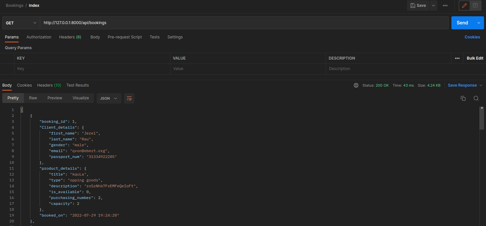
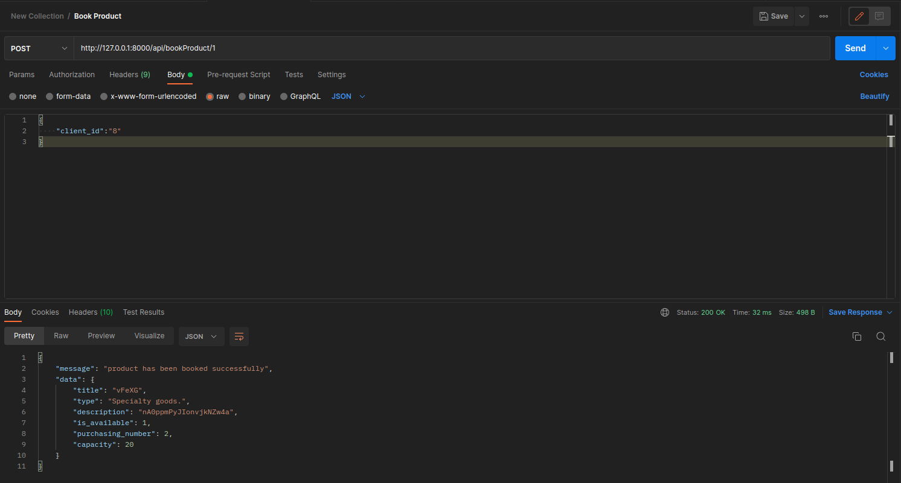

<p align="center"><a href="https://laravel.com" target="_blank"></a></p>

<p align="center" id="top">
<a href="https://travis-ci.org/laravel/framework"></a>
<a href="https://packagist.org/packages/laravel/framework"></a>
<a href="https://packagist.org/packages/laravel/framework"></a>
<a href="https://packagist.org/packages/laravel/framework"></a>
</p>

## Table of contents

- [Overview](#overview)
    - [API Requests](#screenshot)
- [My process](#my-process)
    - [Built with](#built-with)
    - [Libraries](#Libraries)
- [Author](#authors)

## Overview

this is a solution for A tour company has a range of products. Excursions, Custom Packages, Cruises and Transfers.

### API Requests
#### Booking: index method: Will return all bookings in the system


#### product: bookProduct method: Will return all bookings in the system


<p align="right">(<a href="#top">back to top</a>)</p>

## Deployed Version
* [Live](http://awesomesoftware.great-site.net/)

## My process
1) Clone the project

   ``` git clone https://github.com/Hegabovic/travel-backend.git ```

   1) add database connection string to `.env file`
   - to connect to mysql database use:
       ```
       DB_CONNECTION=mysql
       DB_HOST=<your ip address>
       DB_PORT=3306
       DB_DATABASE=<database-name>
       DB_USERNAME=<user-name>
       DB_PASSWORD=<password>
       ```
   - to connect to pgsql database use:
     ```
     DB_CONNECTION=mysql
     DB_HOST=<your ip address>
     DB_PORT=3306
     DB_DATABASE=<database-name>
     DB_USERNAME=<user-name>
     DB_PASSWORD=<password>
     ```
2) in the project directory run the following
    ```
    $composer update
    $composer install
    $composer dump-autoload
    $php artisan serve
    ```
<p align="right">(<a href="#top">back to top</a>)</p>

### Built with

* [Laravel](https://laravel.com/)
* [RestAPI]()

<p align="right">(<a href="#top">back to top</a>)</p>

### Libraries

* [composer](https://getcomposer.org/)
* [illuminate](https://packagist.org/packages/illuminate/database)
* [eloquent](https://packagist.org/packages/chillerlan/php-qrcode)

<p align="right">(<a href="#top">back to top</a>)</p>

## Authors

* LinkedIn - [Abdullah Hegab](https://www.linkedin.com/in/abdullah-hegab/)

<p align="right">(<a href="#top">back to top</a>)</p>

## License
The Laravel framework is open-sourced software licensed under the [MIT license](https://opensource.org/licenses/MIT).
